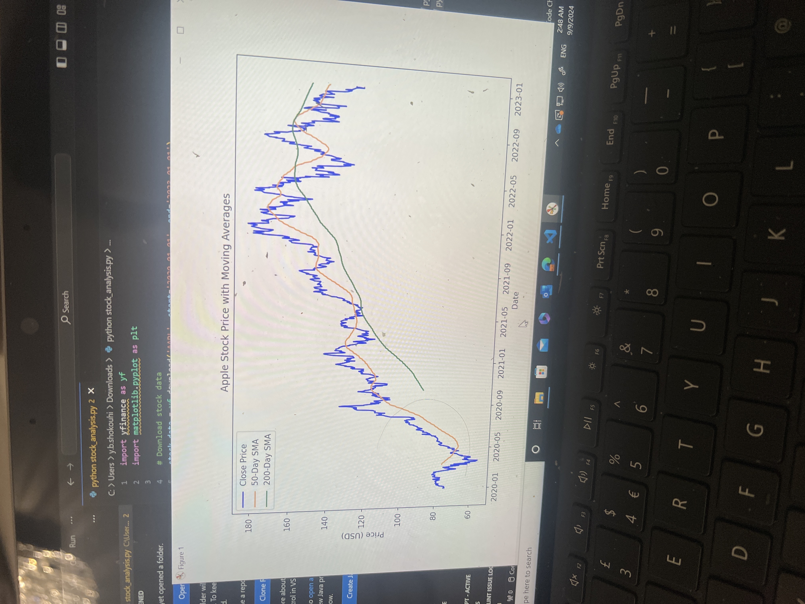

*   **Apple stock price analysis**

1. Introduction 
i as tasked to analyse the stock of apple with the help of python.It involved calculating and plotting 50-day and 200-day simple moving averages over the pass 3 years from 01/2020 to 01/2023. I used yfinance library and matplotlib for visualising the price trends and help me notice paterns and key moments during the stock period eg. when the most buys and sails are.

# Apple Stock Price Analysis

Here’s the graph showing Apple's stock price and moving averages:

![Stock Analysis]  

if theres any error please select them in the Stock anlysis docement 

### Observations:
- The **golden cross** occurred in mid-2021, signaling a bullish trend.
- The **death cross** in late 2022 suggested a potential downward trend.

2. Data analysis 
- I used yfinance library to download the historical stock data of Apple from Yahoo Finance.
- The data was then cleaned and preprocessed to ensure it was in the correct format for analysis.
- I calculated the 50-day and 200-day simple moving averages using the pandas library.
- The moving averages were then plotted using matplotlib to visualize the trends and patterns in the stock price over
the past 3 years.
Results
50 day is short term trends and 200-day is long term trends
this unsures theres no significant fluctuations in the stock and are popular with traiders because of its stability.
Observations from the graph:
Golden Cross: In mid-2021, the 50-day SMA crosses above the 200-day SMA, which is a sign for experiance traders to start buying signal .
Death Cross: In late 2022, the 50-day SMA crosses below the 200-day which is the oppsite of golden cross it is known to be a sell stock sign.
The graph clearly illustrates how moving averages can highlight changes in trend direction, which can be useful for making informed investment decisions.
Overall stock proformance is very well besides from the occasional dips, over the past 3 years (almost doubled) apple stock price increased by a very good amount and the stability is what really intersts traders as its a safe investment.

3. Technical Challenges and problem solving 
-  Library installation: it kept telling me moduleNotFoundError when trying to use metplotlib for the stock data.I started to check if i had it downloaded in the first place by the following cammand pip install matplotlib
which i did the same for yfinance pip install yfinance

- stock market often contained missing values especificly in public holidays e.g. bank holiday and weekends i used panads library which as able to fill out missing information to calculating averages conteniously.
- plotting the moving averages: initially, i encountered diffculties in alingingthe averages i relised it needed an adjustment in frequincy this was done by .rolling methord in pandas stock_data['SMA_50'] = stock_data['Close'].rolling(window=50).mean()
stock_data['SMA_200'] = stock_data['Close'].rolling(window=200).mean()

which helped successfully complete the analysis and generate full and meaningful results.

4. Real world application
  
the moving averages help investors in smoothing out fluctioations and prioitise trends by following the trends and signals
golden cross and death cross are indicators that can be used to make informed investment decisions. The moving averages
can be used to identify potential buy and sell signals, which can help investors make more informed decisions that will likely benifit them and be a positive impact on them financally.

5. Reflections and future work
- The analysis was successful in identifying key trends and patterns in the stock price over the past 3 years, which also helped me achive key understanding about golden and death cross which can help in making decisions 
- Future work could involve analyzing other stocks and comparing their performance to Apple's, or exploring other technical features and comparing them to golden/death cross,
the Exponential Moving Average (EMA), which gives more weight to recent data, making it more sensitive to price changes. I would also consider incorporating volatility measures (such as Bollinger Bands) to provide more context to the stock price movements. Analyzing other stocks and comparing trends across different companies could also provide valuable insights into market behavior

6. Conculusion 
The moving averages analysis of Apple's stock price over the past 3 years has provided valuable insights into how 50-day and 200-day aproach can help and assist investors in making the correct decisions and benifiting them financally in real world trading.

